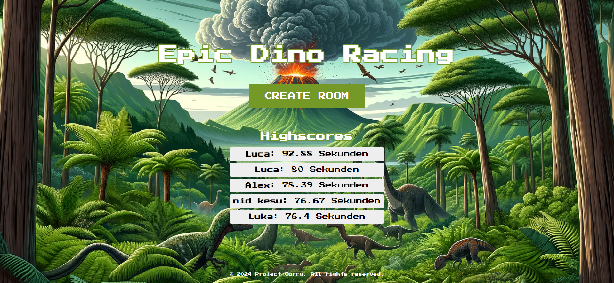
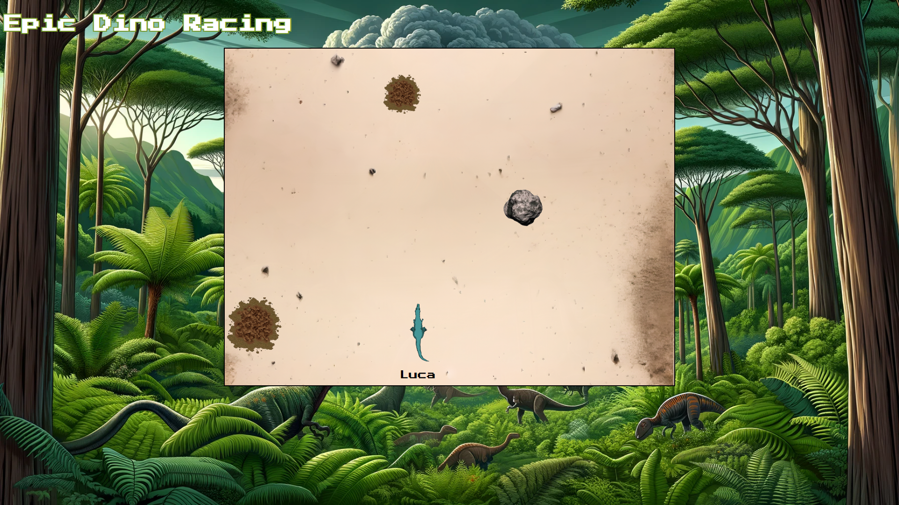

# Multiplayer Dinosaur Game

Welcome to the Multiplayer Dinosaur Game, a dynamic real-time multiplayer game built with Flask and SocketIO. This game allows players to control dinosaurs navigating through a landscape teeming with obstacles, competing to survive as long as possible. (~1500 lines of code)

## Prerequisites

- **Python Version**: Ensure you have Python 3.10.0 installed on your machine.

### Dependencies

Before running the game, you must install several Python libraries:

```bash
pip install Flask Flask-SocketIO Flask-SQLAlchemy eventlet
```

## Features

- **Real-Time Multiplayer Gameplay**: Players can join and play in a shared game environment that updates in real time.
- **Dynamic Obstacle Generation**: The game features a variety of obstacles that appear dynamically on the game field, making each game session unique.
- **High Score Tracking**: Scores are tracked and stored using a SQLite database, allowing players to view and compete for top scores.
- **Cheat Prevention**: The game includes mechanisms to prevent cheating and ensure fair play among participants (hash validation, server validation).
- **Game Room Management**: Players can create rooms or join existing ones, and game creators can manage game sessions.
- **Audio Feedback**: The game provides audio feedback for various events such as jumping, collision, and scoring.

**Information:** The game was mainly crated as a POC. That's why the game is programmed from scratch without any game libraries which made the job much harder.
## Getting Started

Follow these instructions to set up the game on your local machine for development and testing purposes.

1. **Clone the Repository**:
   ```bash
   git clone https://github.com/Luca-Melop/epic-dino-racing.git
   ```
2. **Navigate to the Project Directory**:
   ```bash
   cd epic-dino-racing
   ```
3. **Install Dependencies**:
   ```bash
   pip install -r requirements.txt
   ```
4. **Run the Application**:
   ```bash
   python app.py
   ```
5. **Play!**:
   - open localhost:5000 on your local machine or through [ip]:5000
   - share your personal room link with your friends and have fun together (in the same network just share [your-ip]:[port}, otherwise use port-forwarding or similar)

## Screenshots

### Game Lobby

Here you can choose to join a public room or create a private game session.



### In-Game Experience

Experience the thrill of dodging and navigating through multiple obstacles.



## Contributing

Contributions you make are **greatly appreciated** ;)

## License

This project is licensed under the MIT License - see the [LICENSE](LICENSE) file for details.
